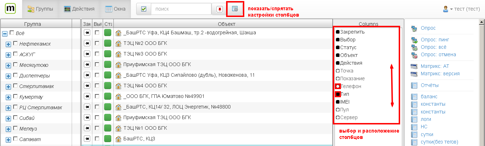
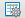

Настройка отображения столбцов
==============================
Главным элементом клиента является список объектов учета. Количество информации в списке можно регулировать настраивая состав и порядок расположения столбцов списка. 

При нажатии на кнопку  справа от списка появится панель с настройками столбцов. На этой панели можно включать/отключать видимость столбцов, а также регулировать порядок их следования перемещая мышью стоки вверх или вниз. 
> чем меньше столбцов показано, тем плавнее становится работа со списком 