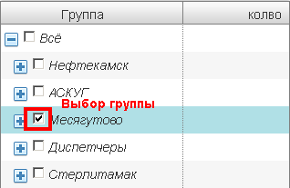

Группы объектов
===============
**Группа объектов** (группа) - совокупность [объектов учета](object.md), объединенная по различным критериям. 

Основные задачи групп:

* Регулировка доступа к объектам. (подробнее см. [доступ](rights.md))
* разбивка множества объектов по различным критериям (территориальный, по потребителю, ГРС и т.п.)

Несмотря на кажущуюся схожесть с деревом, группы на самом деле представляют из себя граф, возможны циклическая вложенность одних групп в другие, один и тот же объект может находиться сразу в нескольких группах и т.п..  

В окне клиента группы расположены слева от основного списка объектов. Выбрать группу можно выделив ее.   

При этом, объекты группы отобразятся в списке объектов.