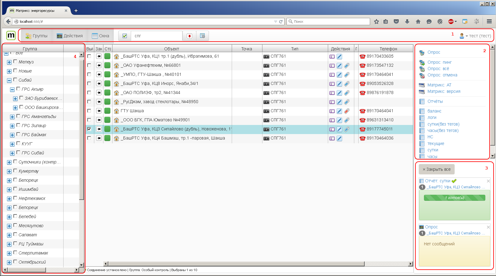

Главное окно
============
Главное окно приложения состоит из следующих основных областей:

* панель ??? (1) 
* панель действий (2)
* панель окон (3)
* дерево групп (4)

Панель ???
----------
На панели расположены кнопки управления видимостью другими панелями, [строка поиска](search-detail.md) а также меню пользователя.
Панель действий
---------------
На данной панели находятся различные **действия** применимые для выбранных объектов учета. Например различные виды опроса, отчеты и т.п..
Панель окон
-----------
Здесь расположены миниатюры свернутых окон. В зависимости от типа окна в миниатюре может быть отображена различная информация, например, прогресс построения отчета, последние сообщения лога опроса и т.п..
Дерево групп
------------
В данной области показана иерархия [групп](groups.md).    