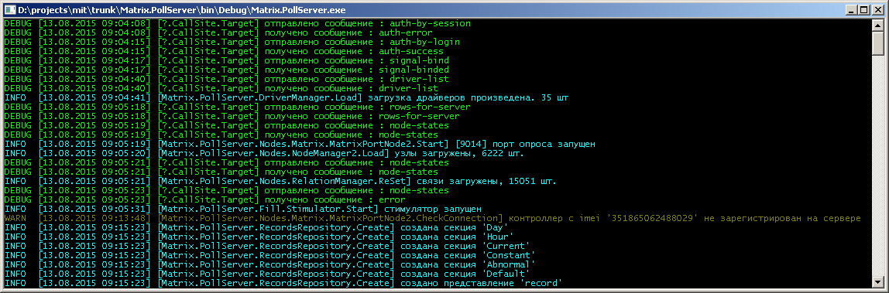

Сервер опроса
=============
**Сервер опроса** - программный модуль, отвечающий за удаленный сбор данных с приборов учета.
 
Комплекс может содержать несколько серверов опроса, при этом сервера идентифицируются по имени, каждый сервер имеет уникальное имя (задается в конфигурации).
 
Каждый сервер опроса включает в себя один или более [портов опроса](poll-port.md).

Сервер опроса может работать в режиме службы или в режиме консоли.

При работе в режиме консоли, есть возможность давать команды серверу:

* `dump` - получить список объектов учета и их статусы на сервере
* `all` - опрос всех объектов на сервере (приоритет как у автоопроса)  