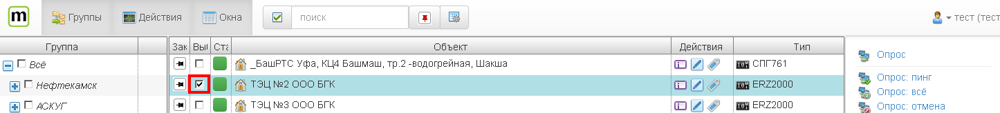
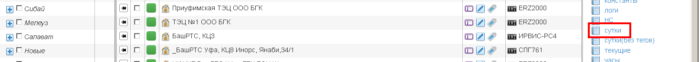
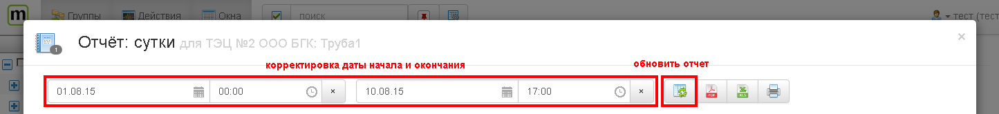
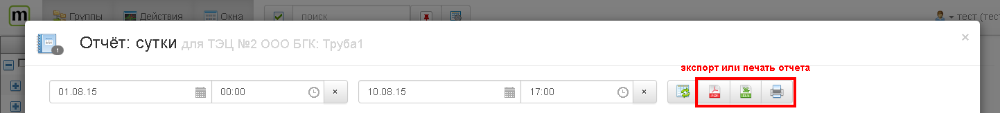

Построение отчетов
==================
Система позволяет строить различные отчеты по выбранным объектам.

* Чтобы построить отчет необходимо выбрать один или более объектов

 
* выбрать отчет, при этом откроется окно с отчетом ([подробнее о работе с окнами](windows.md))

* выбрать даты и обновить отчет

* построенный отчет можно экспортировать в формат pdf или xls, или распечатать

  