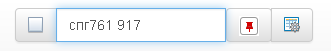

Строка поиска
=============
Строка поиска представляет собой набор компонентов, управляющих списком объектов.

Cлева-направо:

* выбор всех объектов в списке
* многокритериальный фильтр объектов в списке
* скрыть/показать только закрепленные объекты
* настройка видимости и расположения столбцов в списке объектов.  