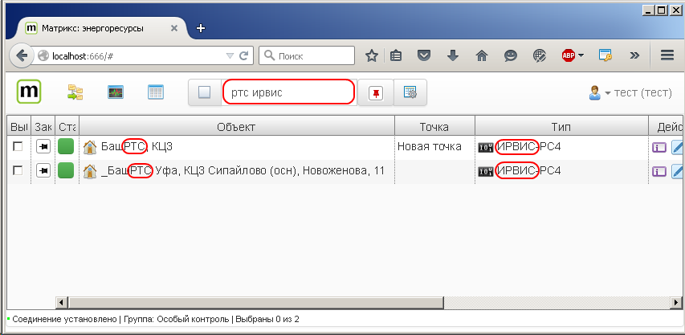
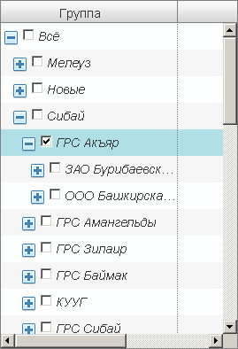
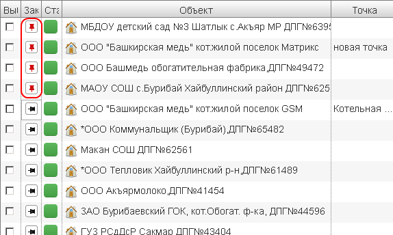

Поиск объектов
==============
Фильтр
------------------
для поиска объектов учета можно воспользоваться полем **поиск**, при этом можно вводить несколько критериев разделенных пробелом.

Поиск по группе
---------------
Объекты учета могут быть сгруппированы по различным критериям, в этом случае посмотреть объекты в группе можно выбрав соответствующюю группу

Закрепление объектов
--------------------
найденные объекты можно закрепить, при этом при поиске в других группах или изменении фильтра закрепленные объекты останутся в списке
