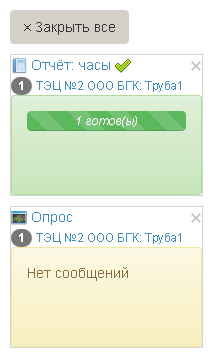
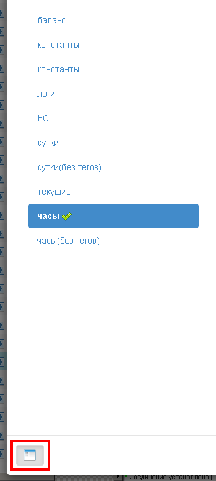

Окна
====
Сворачивание окон
-----------------
Важная информация предоставляется в виде модальных окон. Некоторые окна могут сворачиваться в **трей** - специальная область в правом нижнем углу, при этом миниатюры окон могут отображать важную информацию из окна. 
Чтобы свернуть окно достаточно щелкнуть мышью в область за окном, или нажать кнопку **скрыть**.

Свернутые окна можно закрыть по отдельности или все сразу 

Групповые операции
------------------
Часто одно окно может использоваться для работы с группой связанных объектов различного типа. В этом случае в нижнем левом углу окна присутствует кнопка отображающая элементы группы. 

Например, в окне отчета одного типа для выбранных объектов, можно построить отчеты других типов для той же выборки объектов учета. Или при ручном опросе группы объектов, можно переключаться между всей выборкой и отдельными объектами в выборке.   

